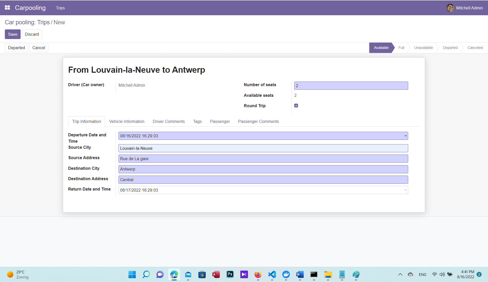

# Odoo Carpooling

Carpooling is nowadays a way people use to share their transportation costs or to reduce fuel consumption and traffic. In order to provide a concert and safe solution for carpooling, an Odoo app has been proposed in this repo, which can be used and installed on the Odoo platform. 

## Problem domain

In this project for 'Open Source Project' course taught by [Prof. Yves Deville](https://scholar.google.com/citations?user=tbGV6OAAAAAJ&hl=en) and [Prof. Olivier Bonaventure](https://scholar.google.com/citations?user=82Qy2m4AAAAJ&hl=en)
at [UClouvain](https://uclouvain.be), the students were asked to contribute to the open source projects. Thus, this repository includes the source code related to the Odoo Carpooling app designed by [Nima Farnoodian](mailto:nima.farnoodian@student.uclouvain.be). The app has been designed so that it can satisfy Odoo user's needs such as:

- Adding extra driver information such as driver's vehicle, vehicle image, etc. in the user settings.

- Sharing (Round) Trips through a booking system (users can book a trip offer, and the drive is able to either refuse or accept the offers).

- Complex search and filtering.

- Commenting on trips by trip passengers.

- etc. 

### Real Estate App

It is worth saying that this repository contains the real estate app under "realestate" branch, which is a part of [Odoo Developer Training](https://www.odoo.com/documentation/15.0/developer.html). Therefore, it could also stand as a helpful source for those people wishing to complete the training. The estate directory holds the solutions up to 13th chapter of the training.

## Local Development Workspace and Installation

In order to install the app under the assumption that Odoo has been installed using Docker, the app should be
mounted within the Odoo container.

### Standing up a local workspace

[See here](https://hub.docker.com/_/odoo/). to learn how to install Odoo using Docker

Run the PostgreSQL server
```
docker run -d -e POSTGRES_USER=odoo -e POSTGRES_PASSWORD=odoo -e POSTGRES_DB=postgres --name db postgres:13

#### Note: passwords could be anything you choose
```
Once the database server runs is complete, you should run an odoo instance and link the odoo-carpooling repo to it as follows:
```
docker run -p 8069:8069 -d --name odoo --link db:db -v [your directory holding "odoo-carpooling" folder]/odoo-carpooling/:/mnt/extra-addons -t odoo -- -d odoo
```
once the app is mounted and the server runs, the carpooling app can appear on the app page and installed accordingly.


## Demo
### [Deployment](https://youtu.be/xO2AnVVy-A4)

### [Report and Tutorial](./files/Open_source_project-Report.pdf) 



## Contribution 

Odoo Carpooling app is open to any contribution. Please feel free to fork the repo (branch 15.0) and extend it with more features.

