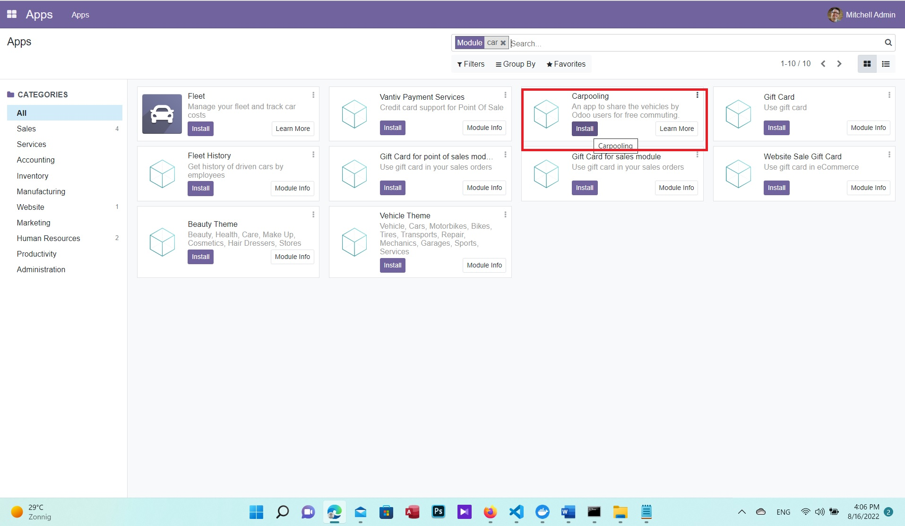

# Installation

In order to install the app under the assumption that Odoo has been installed using Docker, the app should be
mounted within the Odoo container.

## Standing up a local workspace

[See here](https://hub.docker.com/_/odoo/). to learn how to install Odoo using Docker

Run the PostgreSQL server
```
docker run -d -e POSTGRES_USER=odoo -e POSTGRES_PASSWORD=odoo -e POSTGRES_DB=postgres --name db postgres:13

### Note: passwords could be anything you choose
```
Once the database server run is complete, you should run an odoo instance and link the odoo-carpooling repo to it as follows:
```
docker run -p 8069:8069 -d --name odoo --link db:db -v [your director holding "odoo-carpooling" folder]/odoo-carpooling/:/mnt/extra-addons -t odoo -- -d odoo
```
When the app is mounted and the server runs, the carpooling app can appear on the app page and installed accordingly.


